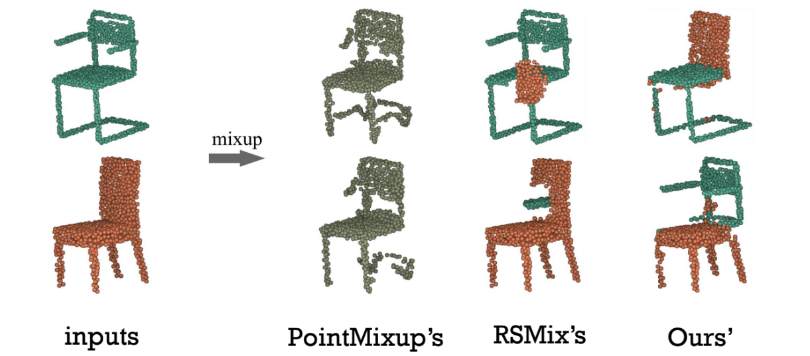
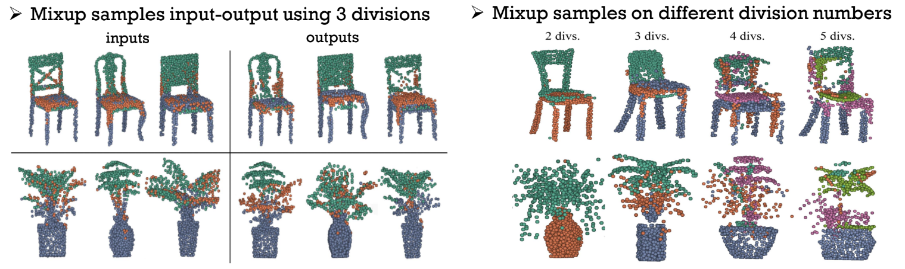

# Point MixSwap

This is the official repository of our ECCV 2022 paper, "Point MixSwap: Attentional Point Cloud Mixing via Swapping Matched Structural Divisions".
<p align="center">

### Dataset
Prepare ModelNet40 dataset by downloading it via [this link](https://shapenet.cs.stanford.edu/media/modelnet40_ply_hdf5_2048.zip). Then, extract the zip file and move to folder such that the structure becomes: `data/modelnet40_ply_hdf5_2048`.

### Train
To train the model, DGCNN with ModelNet40, run the script below (e.g., using the first GPU device):
```CUDA_VISIBLE_DEVICES=0 python main.py --config=configs/config.yaml```

Note: the code is tested in NVIDIA GeForce RTX 3090, using pyhton 3.9 with Ubuntu 18.04.5 LTS.

### Config
Yaml config file can be found in `configs` folder. The file contains all the hyperparamters setup and other related configurations. Most of them are self-explanatory by looking the variable names. Here some details:
* `MIXUP_LEVEL`: where to perform the mixup data, which can be `input`, `feature` and `both`
    * `input`: perform mixup in the input model
    * `feature`: perform mixup in the feature model
    * `both`: perform mixup in both input and feature model    


### Some Visualizations
<p align="center">
   
### Cite
```
@article{pointmixswap,
          author = {Umam, Ardian and Yang, Cheng-Kun and Chuang, Yung-Yu and Chuang, Jen-Hui and Lin, Yen-Yu},
          title = {Point MixSwap: Attentional Point Cloud Mixing via Swapping Matched Structural Divisions},
          booktitle={European Conference on Computer Vision},
          year={2022}
}
```
